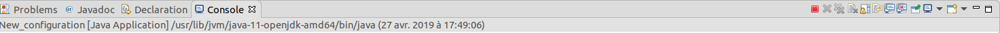

# Compte-rendu du TP01

## Question 1 - `Ctrl + Shift + F`

Ce raccourci permet de formatter automatiquement le texte sélectionné.

Cette option s'avère pratique pour maintenir un formatage homogène sur
l'ensemble du projet, indépendamment du style du programmeur.

**Nota :** Il est possible d'activer le formattage automatique lors de la
sauvegarde du fichier source.

## Question 2 :

Comme le montre l'image, si l'on ferme la fenêtre, le programme continue d'être
exécuté :

## Question 3 :

En rajoutant `setDefaultCloseOperation(JFrame.EXIT_ON_CLOSE);`, on
relie l'évènement de la fermeture de la fenêtre à la terminaison du programme.

Ainsi, en fermant la fenêtre, le programme s'arrête.